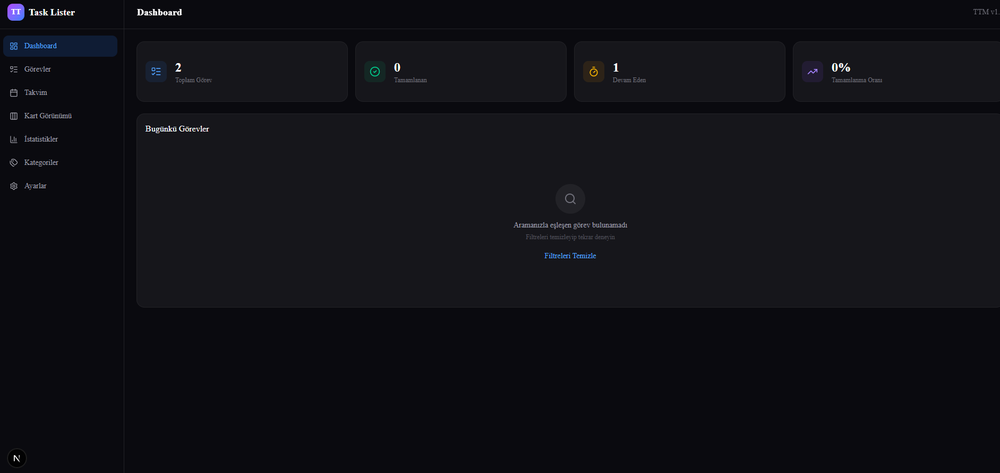
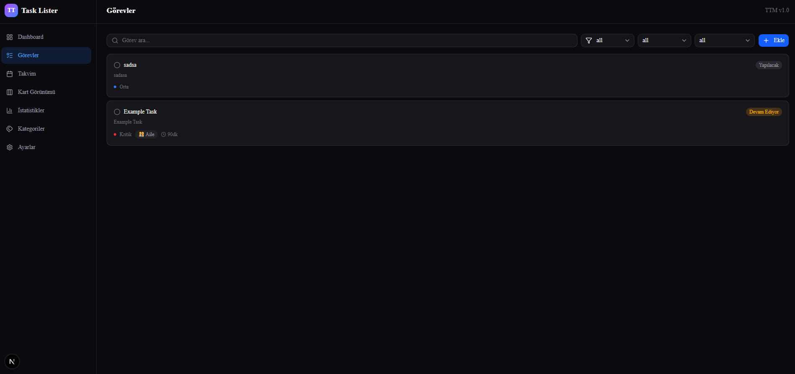
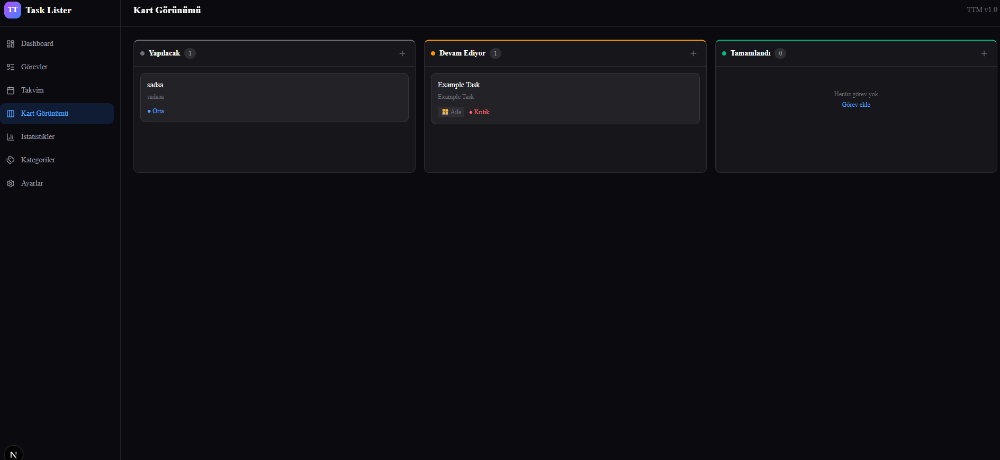
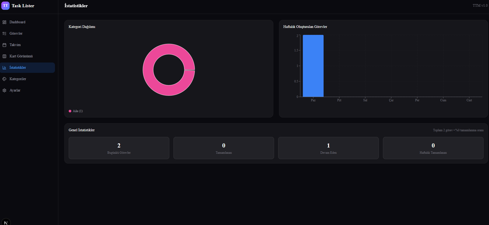
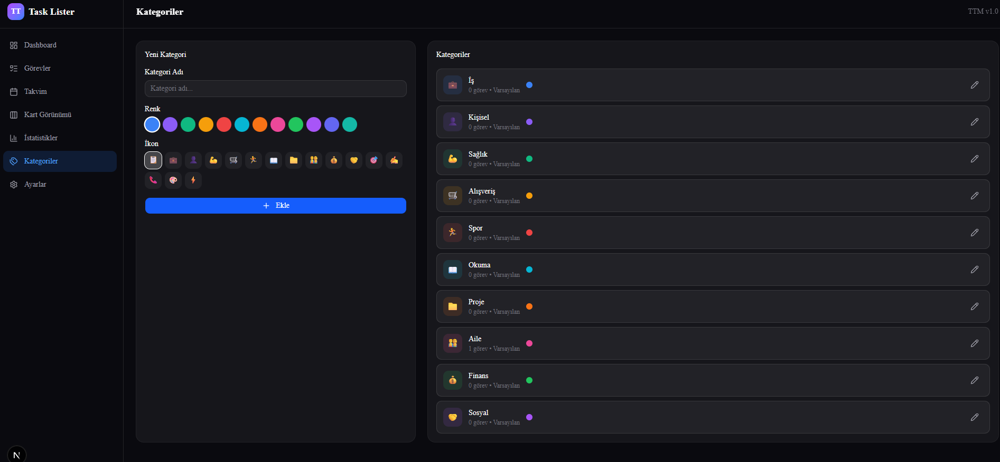

# TaskLister — Daily Task Planning Panel · Günlük Görev Planlama Paneli

> **EN:** A dark-themed, full-featured task management app with EN/TR support. Plan, track, and complete your daily tasks.  
> **TR:** EN/TR dil desteğiyle, dark theme ile tasarlanmış tam özellikli bir görev yönetim uygulaması. Günlük işlerinizi planlayın, takip edin ve tamamlayın.

---

## Features · Özellikler

### Language Support · Dil Desteği
| EN | TR |
|----|----|
| Turkish (TR) — default UI language | Türkçe (TR) — varsayılan arayüz dili |
| English (EN) — full translation support | İngilizce (EN) — tam çeviri desteği |
| All labels, placeholders, errors & notifications in both languages | Tüm etiketler, placeholder'lar, hata mesajları ve bildirimler çift dilli |
| Auto-detected from browser language | Dil tercihi tarayıcı diline göre otomatik algılanır |

### Dashboard · Panel
- **EN:** Total tasks, completed, in-progress, completion rate stat cards — Today's tasks at a glance — SWR-powered auto cache & live updates
- **TR:** Toplam görev, tamamlanan, devam eden, tamamlanma oranı istatistik kartları — Bugünkü görevlerinizi hızlıca görün — SWR ile otomatik önbellek

### Task Management · Görev Yönetimi
- **EN:** Full CRUD — Live search with 300ms debounce — Filter by status (Todo / In Progress / Done), priority (Low / Medium / High / Critical), category — Title, description, date, start/end time, estimated duration — Sub-task support with checkbox toggle & drag-to-reorder — Recurring tasks (daily / weekly / monthly)
- **TR:** Tam CRUD işlemleri — 300ms debounce ile canlı arama — Durum (Yapılacak / Devam Ediyor / Tamamlandı), öncelik (Düşük / Orta / Yüksek / Kritik) ve kategori filtresi — Başlık, açıklama, tarih, başlangıç/bitiş saati, tahmini süre — Alt görev desteği (checkbox, sürükle-bırak) — Tekrarlayan görev (günlük / haftalık / aylık)

### Calendar View · Takvim Görünümü
- **EN:** Custom month calendar optimized with React.memo & useMemo — Color-coded task preview per day — Month navigation, today highlight
- **TR:** React.memo ve useMemo ile optimize özel ay takvimi — Her gün renk kodlu görev gösterimi — Ay navigasyonu, bugün vurgusu

### Kanban Board · Kart Görünümü
- **EN:** 3 columns: TODO, IN_PROGRESS, DONE — HTML5 Drag-and-Drop — Instant status update — Task counter per column
- **TR:** 3 sütun: TODO, IN_PROGRESS, DONE — HTML5 Sürükle-Bırak — Anlık durum güncelleme — Her sütunda görev sayacı

### Statistics · İstatistikler
- **EN:** Pie chart for category distribution — Bar chart for weekly created tasks — Summary stat cards
- **TR:** Kategori dağılımı pasta grafiği — Haftalık oluşturulan görevler çubuk grafiği — Özet istatistik kartları

### Category Management · Kategori Yönetimi
- **EN:** CRUD operations — 12 preset colors & 16 emoji icons — Default categories protected from deletion — Task count per category
- **TR:** CRUD işlemleri — 12 hazır renk ve 16 emoji ikonu — Varsayılan kategoriler silinemez — Her kategoride görev sayacı

### Settings & Notifications · Ayarlar & Bildirimler
- **EN:** Browser Notification API — Webhook URL configuration (stored in localStorage) — Auto webhook trigger on task updates
- **TR:** Browser Notification API ile tarayıcı bildirimleri — Webhook URL yapılandırması (localStorage) — Görev güncellemelerinde otomatik webhook tetikleme

### Performance · Performans
- **EN:** Skeleton loading states (task cards, stats, calendar, kanban) — SWR with 500ms deduplication — React.memo on TaskCard, KanbanCard, DayCell — useMemo & useCallback optimization — Debounced search (300ms)
- **TR:** Skeleton loading state'leri — SWR 500ms deduplication — React.memo optimizasyonu — useMemo ve useCallback — Debounce arama (300ms)

---

## Tech Stack · Teknoloji Yığını

| Layer · Katman | Technology · Teknoloji | Version · Versiyon |
|----------------|------------------------|---------------------|
| Framework | Next.js (App Router) | 16 |
| Language · Dil | TypeScript | ^5 |
| Database · Veritabanı | PostgreSQL 16 (Docker) | 16-alpine |
| ORM | Prisma | ^6 |
| CSS | Tailwind CSS v4 | ^4 |
| UI Components | shadcn/ui (base-nova) | ^4 |
| Icons · İkonlar | Lucide React | ^1 |
| Data Fetching | SWR | ^2 |
| Charts · Grafikler | Recharts | ^3 |
| Validation · Validasyon | Zod | ^4 |
| Testing · Test | Vitest + Testing Library | ^4 |

---

## Architecture · Mimariler

```
src/
├── app/                    # Next.js App Router pages & API / sayfalar ve API
│   ├── layout.tsx          # Root layout (Sidebar + Header + ErrorBoundary)
│   ├── page.tsx            # Dashboard / Panel
│   ├── tasks/page.tsx      # Task list / Görev listesi
│   ├── calendar/page.tsx   # Calendar view / Takvim görünümü
│   ├── board/page.tsx      # Kanban board
│   ├── stats/page.tsx      # Statistics / İstatistikler
│   ├── categories/page.tsx # Category management / Kategori yönetimi
│   ├── settings/page.tsx   # Settings / Ayarlar
│   └── api/                # REST API routes
│       ├── tasks/          # Task CRUD / Görev CRUD
│       ├── categories/     # Category CRUD / Kategori CRUD
│       ├── subtasks/       # SubTask CRUD / Alt görev CRUD
│       ├── stats/          # Statistics / İstatistikler
│       └── cron/recurring/ # Recurring task cron / Tekrarlayan görev cron
├── components/
│   ├── layout/             # Sidebar, Header
│   ├── tasks/              # TaskList, TaskCard, TaskForm, SubTaskList
│   ├── dashboard/          # StatsCards, TodayTasks
│   ├── calendar/           # CalendarView
│   ├── board/              # KanbanBoard
│   ├── stats/              # Charts
│   ├── categories/         # CategoryManager
│   ├── ui/                 # shadcn/ui components
│   └── ErrorBoundary.tsx   # React Error Boundary
├── services/               # Business logic service layer / İş mantığı servis katmanı
│   ├── taskService.ts      # Tasks, categories, subtasks, stats
│   ├── recurringService.ts # Recurring task processor / Tekrarlayan görev işlemcisi
│   └── webhookService.ts   # Webhook sender / Webhook gönderici
├── lib/
│   ├── prisma.ts           # Prisma client singleton
│   ├── fetchers.ts         # SWR hooks (useTasks, useCategories, mutations)
│   ├── validations.ts      # Zod schemas / Zod şemaları
│   ├── rate-limit.ts       # In-memory rate limiter
│   ├── constants.ts        # Labels, colors / Etiketler, renkler
│   └── utils.ts            # cn() helper / cn() yardımcısı
├── hooks/
│   └── useDebounce.ts      # Debounce hook
├── types/
│   └── index.ts            # TypeScript types / TypeScript tipleri
└── test/
    └── *.test.ts           # Unit tests / Birim testler
```

---

## Database Schema · Veritabanı Şeması

### Category

| Field · Alan | Type · Tip | Description · Açıklama |
|-------------|-----------|-----------------|
| id | String (cuid) | Primary key |
| name | String | Unique category name / Benzersiz kategori adı |
| color | String | HEX color code / HEX renk kodu |
| icon | String | Emoji icon / Emoji ikonu |
| isDefault | Boolean | Default category protection / Varsayılan kategori koruması |
| createdAt | DateTime | Created timestamp / Oluşturma zamanı |

### Task

| Field · Alan | Type · Tip | Description · Açıklama |
|-------------|-----------|-----------------|
| id | String (cuid) | Primary key |
| title | String | Task title / Görev başlığı |
| description | String? | Description / Açıklama |
| date | DateTime? | Task date / Görev tarihi |
| startTime | String? | Start time / Başlangıç saati |
| endTime | String? | End time / Bitiş saati |
| priority | Enum | LOW, MEDIUM, HIGH, CRITICAL |
| status | Enum | TODO, IN_PROGRESS, DONE |
| estimatedMin | Int? | Estimated duration (min) / Tahmini süre (dk) |
| isRecurring | Boolean | Recurring task / Tekrarlayan görev |
| recurringRule | String? | daily, weekly, monthly |
| categoryId | String? | FK → Category (ON DELETE SET NULL) |
| subtasks | SubTask[] | Sub-tasks (CASCADE) / Alt görevler (CASCADE) |

### SubTask

| Field · Alan | Type · Tip | Description · Açıklama |
|-------------|-----------|-----------------|
| id | String (cuid) | Primary key |
| title | String | Sub-task title / Alt görev başlığı |
| isDone | Boolean | Completion status / Tamamlandı durumu |
| taskId | String | FK → Task (CASCADE) |
| order | Int | Sort order / Sıralama |

---

## API Endpoints · API Endpoint'leri

> **EN:** All endpoints return JSON. `POST` and `PATCH` requests validated with Zod.  
> **TR:** Tüm endpoint'ler JSON döner. `POST` ve `PATCH` istekleri Zod ile validate edilir.  
> **Rate limit:** 100 requests per 60 seconds per IP · IP başına 60 saniyede 100 istek.

| Method · Metod | Endpoint | Description · Açıklama |
|---------------|----------|-----------------|
| GET | `/api/tasks` | List tasks (filter: status, priority, categoryId, date, search) · Görev listesi |
| POST | `/api/tasks` | Create task · Görev oluştur |
| GET | `/api/tasks/[id]` | Get single task · Tekil görev |
| PATCH | `/api/tasks/[id]` | Update task · Görev güncelle |
| DELETE | `/api/tasks/[id]` | Delete task · Görev sil |
| GET | `/api/categories` | List categories (with task counts) · Kategori listesi |
| POST | `/api/categories` | Create category · Kategori oluştur |
| PATCH | `/api/categories/[id]` | Update category · Kategori güncelle |
| DELETE | `/api/categories/[id]` | Delete category · Kategori sil |
| POST | `/api/subtasks` | Create sub-task · Alt görev oluştur |
| PATCH | `/api/subtasks/[id]` | Update sub-task · Alt görev güncelle |
| DELETE | `/api/subtasks/[id]` | Delete sub-task · Alt görev sil |
| GET | `/api/stats` | Dashboard statistics · Dashboard istatistikleri |
| GET | `/api/cron/recurring` | Process recurring tasks · Tekrarlayan görevleri işle |

---

## Getting Started · Başlangıç

### Requirements · Gereksinimler
- Node.js >= 20
- Docker (for PostgreSQL · PostgreSQL için)

### Setup · Kurulum

```bash
# Clone the repo · Repoyu klonlayın
git clone https://github.com/andorabilisim/tasklister.git
cd tasklister

# Install dependencies · Bağımlılıkları yükleyin
npm install

# Configure environment · Ortam değişkenlerini ayarlayın
cp .env.example .env
# Edit DATABASE_URL in .env · .env dosyasındaki DATABASE_URL'i düzenleyin

# Start PostgreSQL · PostgreSQL'i başlatın
docker-compose up -d

# Run database migrations · Veritabanı migration'larını çalıştırın
npx prisma migrate dev

# Seed sample data (10 default categories) · Örnek verileri yükleyin
npm run seed

# Start dev server · Geliştirme sunucusunu başlatın
npm run dev
```

Open · Açın: [http://localhost:3000](http://localhost:3000)

### Recurring Task Cron · Tekrarlayan Görev Cron

> **EN:** To process recurring tasks daily:  
> **TR:** Tekrarlayan görevlerin günlük işlenmesi için:

```bash
# Manual trigger · Manuel tetikleme
npm run cron

# crontab auto (daily at 00:00) · crontab otomatik (her gün 00:00)
0 0 * * * curl http://localhost:3000/api/cron/recurring
```

---

## Scripts · Script'ler

| Command · Komut | Description · Açıklama |
|----------------|-----------------|
| `npm run dev` | Dev server (Turbopack) · Geliştirme sunucusu |
| `npm run build` | Production build · Production build |
| `npm run start` | Production server · Production sunucusu |
| `npm run lint` | ESLint code check · ESLint kod kontrolü |
| `npm run format` | Prettier format · Prettier formatlama |
| `npm run format:check` | Format check · Format kontrolü |
| `npm test` | Run tests · Testleri çalıştır |
| `npm run test:watch` | Tests in watch mode · Watch modunda test |
| `npm run test:coverage` | Tests + coverage report · Test + kapsam raporu |
| `npm run seed` | Seed database · Örnek veri yükle |
| `npm run cron` | Trigger recurring tasks · Tekrarlayan görevleri tetikle |

---

## Development Notes · Geliştirme Notları

### Security · Güvenlik
- `.env` is in `.gitignore` — never commit it · `.env` dosyası `.gitignore`'da — asla commit etmeyin
- `.env.example` provided as template · `.env.example` şablon olarak referans
- API endpoints protected with rate limiting (100 req/min per IP) · Rate limit koruması (IP başına 100 istek/dk)
- All inputs validated with Zod · Tüm input'lar Zod ile validate edilir

### Code Quality · Kod Kalitesi
- ESLint 9 (flat config) + Next.js core-web-vitals + TypeScript rules
- Prettier for consistent formatting · Prettier ile tutarlı formatlama
- Service layer separates business logic from API routes · Servis katmanı ile API route'larından ayrılmış iş mantığı
- try-catch error handling on all API routes · Tüm API route'larında try-catch hata yönetimi

### Tests · Testler
- Vitest + Testing Library unit tests · Birim testler
- Zod validation tests · Zod validasyon testleri
- Rate limiter tests · Rate limiter testleri
- useDebounce hook tests · useDebounce hook testleri
- Constants tests · Sabitler testleri

---

## Screenshots · Ekran Görüntüleri

> **EN:** Screenshots of the main pages.  
> **TR:** Ana sayfaların ekran görüntüleri.

### Dashboard · Panel


### Task List · Görev Listesi


### Kanban Board · Kart Görünümü


### Calendar · Takvim


### Statistics · İstatistikler


### Category Management · Kategori Yönetimi


### Task Form · Görev Formu


---

## License · Lisans

MIT — see [LICENSE](./LICENSE) file · [LICENSE](./LICENSE) dosyasına bakın
